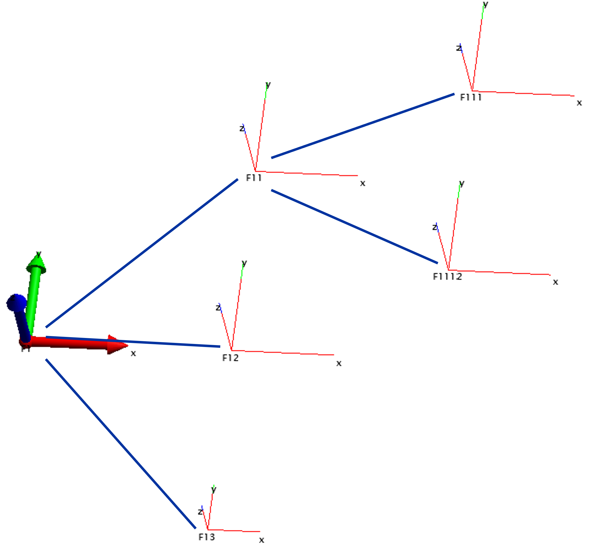
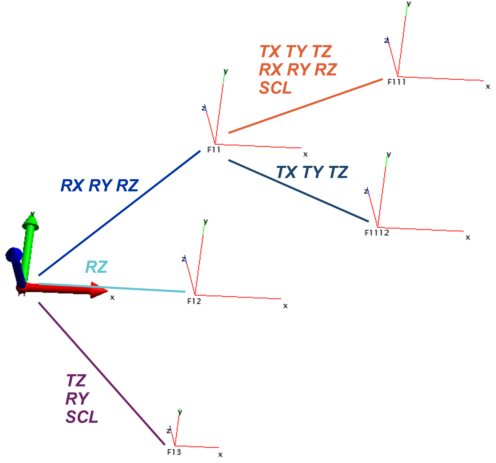

The `*FRAME` section defines a coordinate transformation relative to a parent frame using Helmert transformation parameters. A FRAME can contain:

- Points (declared using `*CALA` or `*POIN`)
- Measurements (`*UVEC`, `*UVD`, `*OBSXYZ`, `*ANGL`, `*ZEND`, `*DIST` ,`*INCL`)
- Other `*FRAME`

## Syntax

Each coordinate system opens with the keyword `*FRAME` and is closing with the keyword `*ENDFRAME`. The keyword `*ENDFRAME` closes the last opened coordinate system.

```text
*FRAME name trx_m try_m trz_m rx_gon ry_gon rz_gon scale [TX] [TY] [TZ] [RX] [RY] [RZ] [SCL] [SLAVE groupName]
...
*ENDFRAME

-----
Mandatory arguments:
tr*_m:		Translations [m] along * axis
r*_gon:		Rotations [gon] aroung the *axis, left-hand rule
scale: 		Scale factor (unitless)

Optional arguments:
TX, TY, ..., SCL: 	Make parameters adjustable
SLAVE groupName: 	Assigns frame to a constrained group


```

Measurements restricted to the root frame are clearly indicated in keyword documentation.

Degree of freedoms via the optional arguments (`TX`, `TY`,`TZ`,`RX`,`RY`,`RZ`,`SCL`) can be defined individually. They are always for the current Helmert transformation with respect to its parent coordinate system.

## Simple example

```text
*FRAME  F1	0    0     0    0  0  0  1

     *FRAME  F11	1    1     0    0  0  0  1
          *FRAME  F111	1    0.5  0    0  0  0  1
          *ENDFRAME		%closing of Frame F111

         *FRAME  F112	1   -0.5  0    0  0  0  1
         *ENDFRAME		%closing of Frame F112
    *ENDFRAME		%closing of Frame F11

    *FRAME  F12	1    0    0    0  0  0  1
    *ENDFRAME		%closing of Frame F12

    *FRAME  F13	1  -1    0    0  0  0  1
    *ENDFRAME		%closing of Frame F13

*ENDFRAME	%closing of Frame F1

```

The previous structure is represented such:


## Same example with DOF

```text
*FRAME  F1	0    0     0    0  0  0  1

     *FRAME  F11	1    1     0    0  0  0  1 RZ RY RX
          *FRAME  F111	1    0.5  0    0  0  0  1  TX TY TZ RX RY RZ SCL
          *ENDFRAME		

         *FRAME  F112	1   -0.5  0    0  0  0  1  TY TX TZ
         *ENDFRAME		
    *ENDFRAME		

    *FRAME  F12	1    0    0    0  0  0  1 RZ
    *ENDFRAME		

    *FRAME  F13	1  -1    0    0  0  0  1 SCL RY TZ
    *ENDFRAME		

*ENDFRAME
```

Equates to this graphical representation:
