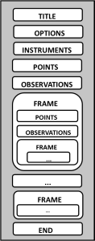

# General File Layout

Every file has to start with the keyword `*TITR` with a new line after the keyword followed by an arbitrary number of lines and blank lines. This input is used in the output file in the same way as it appeared in the input file. The file must be closed by `*END` or `*FIN`.

The title keyword is followed by options and instrument data. Points, measurements and frames may occur inside (nested) frame sections. Note that certain points and measurements are only allowed in the root frame (i.e. outside any `*FRAME` keyword).

Lines can be commented by using the '%' or the '#' symbol, a line starting with one of these letters is ignored.

Blank lines are also ignored and skipped in the reading procedure.

**Keywords have place. They cannot be use anywhere, be careful (follow the order above).**