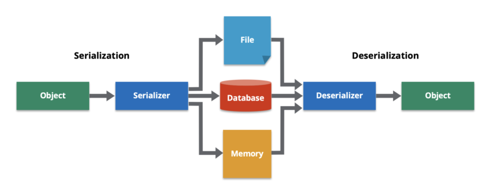

### What is serialization?

In general, serialization is the process of converting a data object into a stream of bytes that can be later stored in various formats (e.g. a JSON file). An overview of the serialization and deserialization processes can be represented with the following figure.

### What is JSON format?

**JSON** is a language-independent data format used to store and interchange data. JSON stands for **JavaScript Object Notation** and the filenames of this format typically use the extension *`.json`* .

The advantages of such data formats include:

1.  The data are stored in a **human-readable** text.
2.  The data represent objects consisting of **[attribute–value pairs](https://en.wikipedia.org/wiki/Attribute%E2%80%93value_pair)** , in which the value can be either of any standard data type (e.g., string, boolean, integer, float, etc.), or any other serializable object (e.g., list, array, etc.).
3.  JSON is a language-independent data format. Moreover, many modern programming languages offer code packages to read/parse and write/generate JSON-format data.

### When it was introduced in LGC?

The *serialization* of the LGC data objects and, therefore, the option to generate a JSON file after an LGC computation was introduced in **LGC version 2.6.0**. The main functionality of the serializer is part of the SurveyLib library.

For the serialization, it was decided to mainly preserve the variable names of LGC and SurveyLib as attribute names (keys) of the JSON structure. Moreover, the structure of the JSON file basically inherits and therefore represents the structure of the classes, in which the relevant data are stored.

### How the JSON file can be obtained?

To get the JSON file as an output of an LGC computation the keyword **\*JSON** is required to be added in the preamble of the LGC input file.