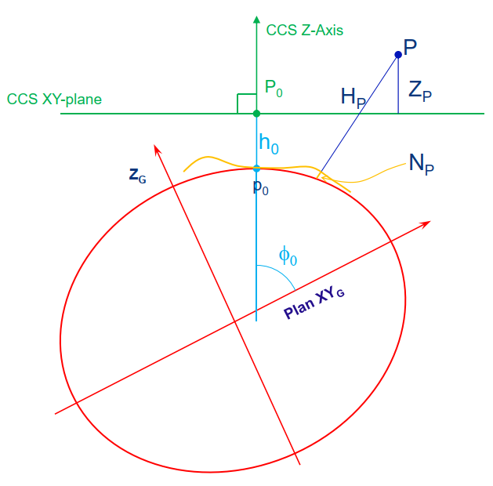
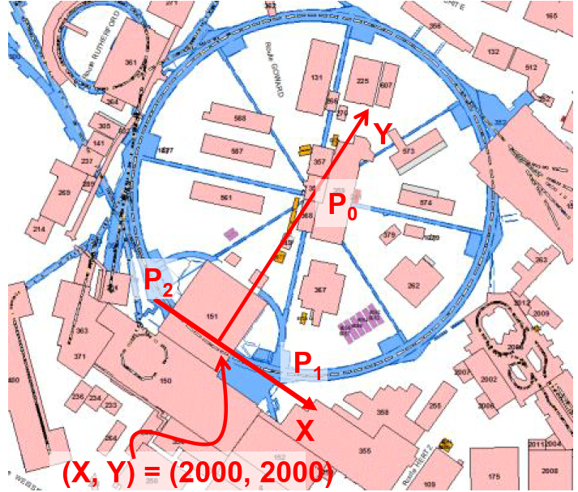

# Datum

The software operates only 3D computation in a Cartesian XYZ system, but due to the extensive scope of the CERN accelerator complex, LGC manages three local geoid models: a simple spherical model, the CERN Geoid 1985 (CG1985) and 2000 (CG2000). 
The geoid models are, for instance, used in the observation made by a Total Station to establish its vertical vector in the CERN Coordinate System (CCS) expressed in XYZ.
A datum keyword must be defined in the input file.

## OLOC
The calculation is based on a Euclidean reference frame in a Cartesian coordinate system.

This datum should only be used for local computation as no geodesical parameters are taken into account.

```text
Usage:
    *OLOC
```

## RS2K
The calculation is done in the CERN Coordinate System (CCS).

The vertical reference surface is the geoid model CG2000 determined in the plane of the LHC machine in the year 2000, and the altitudes of the points are converted into Z coordinates using this geoid model.
```text
Usage:
    *RS2K
```

## LEP
The calculation is done in the CERN Coordinate System (CCS).

The vertical reference surface is the geoid model CG1985 determined in the plane of the LEP machine in the year 1985, and the altitudes of the points are converted into Z coordinates using this geoid model.

```text
Usage:
    *LEP
```

## SPHE
The calculation is done in the CERN Coordinate System (CCS).

The vertical reference surface is a spherical model established for the SPS, and the altitudes of the points are converted into Z coordinates using this geoid model.
```text
Usage:
    *SPHE
```

## Quick definition of the CERN Coordinate System (CCS)
The CERN Coordinate System (CCS) is a reference Frame with a 3D Cartesian Coordinate System. 
Various observations of 3 points on pillars (P0, P1 and P2) was carried out in the 1970s to determine the CCS.
It is defined by the Point P0 situated on a pillar at the center of the CERN PS accelerator. 
The local vertical at P0 is colinear with the CSS Z-axis. the Point P0 situated on a pillar at the center of the CERN PS accelerator.  
The CCS has an azimuth of 37.77864 gons with respect to the GRS80.
 




To go deeper check the document [EDMS107981](https://edms.cern.ch/ui/file/107981/1/cerndatums.pdf) or this paper presented at the IWAA 2016: [Link](https://cds.cern.ch/record/2680829/files/352.pdf).

